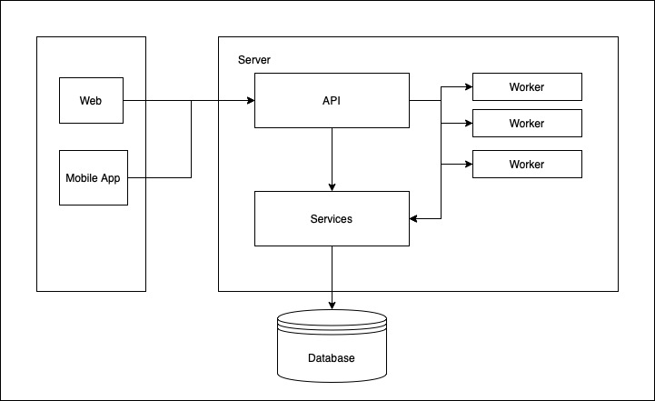

# Backend Engineer Challenger Answer (BECA)

BECA is a simple Restful API server used to manage repositories and trigger scan for SECRET_KEY in repository source code.

## Prerequisite

-   Go v1.17+
-   PostgreSQL 12+

## Install

Create a database in PostgreSQL server

```sh
CREATE DATABASE beca;
```

Copy SQL inside [database-schema.sql](database-schema.sql) and execute with created database (beca) to create required tables

To run server, execute:

```sh
DATABASE_URL=postgres://postgres@localhost/beca go run cmd/beca/main.go
```

Swagger document can be access at [http://localhost:3000/swagger/index.html](http://localhost:3000/swagger/index.html)

To run tests, execute:

```sh
PGX_TEST_DATABASE=postgres://postgres@localhost/beca-test go test ./...
```

## Design



The Server consist of 3 elements:

-   Services: a layer used to communicate with database.
-   API: a layer handle request from outside, use services for data management and send scan job to background workers on scan triggered.
-   Worker: provide logic for background workers, used to perform repository scanning and update result.

### Why Worker?

In real life, due limitations of hardware, number of servers, and scanning logic, the duration need to perform a repository might be quite long, so it isn't suitable for the API handler to directly perform scan login in order to increase API latency.

After receive scan trigger request, API should create a Result and queued it to be update later by worker, which perform all the scanning logic and update Result. User can request Result from API later for scan Findings.

Because the goal of project is simple API Server, the design of Worker and interations between API and Worker is quite simple. Each worker run in background in it own goroutine. API communicate with workers via a channel, API will send Result ID via channel to trigger worker scanning process. This design is simple and effective with small program, but will suffer when scaling because Worker coupled with API Server, so it only can run on single machine. Beside that, re-try logic and back pressure isn't implemented.

In real life situation, Worker can be split to it own program, and communicate with API Server via a proper messaging queue like Kafka or Rabbit MQ, so Worker can be deploy in many machine and isolate with API Server

### Flow Diagram

[](https://mermaid.live/edit/#pako:eNqNksFOwzAQRH9l5XOr3n2oFImCOFERUC65GHtJTRM77DqVqqr_jo3TlNJK4JOtN54Zr3wQ2hsUUjB-Dug03lnVkOpqB3EpHTzBKyPlc68oWG175QIUoBiK9eM1KRMpkXZWI1_jKuHK0xZppClgvlwWEtZP5QssCHvPNkbb0_0i4qSSQMi9d4zwPIn-4bI4kDXHBWvlzoalBE2oQvLioQ2ZlNmDMAzkLsjNEj9x5JUERmfgw79BSoOpxX4aqd2lzCqfq3nOuymucsuhN-nGvXXGuoYh-Itgg79Nz6N4WH1PIon5j1eM_LTETHRInbIm_o5DYrUIG-ywFjJuW9tsQi1qd4zCXHBlUnUh31XLOBNqCL7cOy1koAFPovF_jarjFyW00UU)
